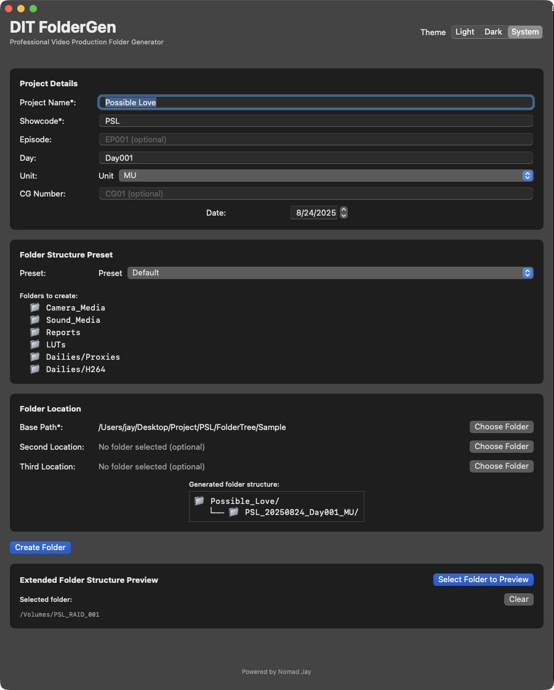

# DIT FolderGen

A professional SwiftUI macOS application designed for Digital Imaging Technicians (DITs) to automatically generate standardized shooting day folder structures for video production.



## Features

- **Professional Folder Generation**: Create standardized folder structures based on industry conventions
- **Customizable Presets**: Load and use different folder structure presets from JSON files
- **Smart Naming Logic**: Automatic folder name generation following production naming standards
- **Theme Support**: Light, Dark, and System theme modes
- **Folder Structure Preview**: Visual tree preview with file sizes
- **Export Options**: Export folder structure to PDF or CSV formats
- **Finder Integration**: Direct access to created folders in Finder
- **Settings Persistence**: Remembers last used settings and preferences

## Requirements

- macOS 13.0 or later
- Xcode 15.0 or later (for building)

## Installation

1. Open the project in Xcode
2. Build and run the application
3. The app will create sample preset files in the `Presets/` folder on first launch

## Usage

### Basic Workflow

1. **Enter Project Details**:
   - Project Name (required)
   - Showcode (3 letters, required)
   - Episode (optional)
   - Day (required)
   - Unit (MU, 2U, CG, TEST)
   - CG Number (optional for CG shoots)
   - Date (defaults to today)

2. **Select Folder Location**:
   - Choose base directory where folders will be created
   - App remembers last used location

3. **Choose Preset**:
   - Select from available folder structure presets
   - Default presets: Default, Extended, Minimal, Documentary

4. **Create Folders**:
   - Click "Create Folder" to generate the structure
   - App prevents overwriting existing folders

5. **Preview & Export**:
   - View folder structure with file sizes
   - Export to PDF or CSV formats
   - Open directly in Finder

### Folder Naming Logic

The app generates folder names using these patterns:

- **With Episode**: `SHOWCODE_YYYYMMDD_EP###_Day###_UNIT`
- **Without Episode**: `SHOWCODE_YYYYMMDD_Day###_UNIT`
- **CG Shoots**: `SHOWCODE_YYYYMMDD_CG##_CG`
- **Test Shoots**: `SHOWCODE_YYYYMMDD_TEST01_Day999_TEST`

### Custom Presets

Create custom folder structure presets by adding JSON files to the `Presets/` folder:

```json
{
  "preset_name": "My Custom Preset",
  "folders": [
    "Camera_Media/A_Camera",
    "Camera_Media/B_Camera",
    "Sound_Media",
    "Reports",
    "Dailies/Proxies",
    "Dailies/Finals"
  ]
}
```

## Project Structure

```
DIT_FolderGen/
├── DIT_FolderGen.swift          # Main app entry point
├── ContentView.swift            # Main UI view
├── Models/
│   ├── FolderPreset.swift       # Preset data model
│   └── AppSettings.swift        # App settings and state
├── Services/
│   ├── PresetManager.swift      # Preset loading and management
│   └── FolderManager.swift      # Folder operations and exports
├── Presets/                     # JSON preset files
└── Info.plist                  # App configuration
```

## Technical Details

- **Framework**: SwiftUI for modern macOS UI
- **Persistence**: UserDefaults for settings storage
- **File Operations**: FileManager for folder creation
- **Export**: Core Graphics for PDF, CSV for structured data
- **Sandboxing**: Proper entitlements for file system access

## Build Configuration

The app includes proper sandboxing entitlements:
- User-selected file read/write access
- Downloads folder read/write access
- Hardened runtime enabled

## Version History

### v1.0.0
- Initial release with core folder generation features
- Theme support and settings persistence
- PDF/CSV export functionality
- Multiple folder structure presets

## Copyright

Copyright © 2025 Nomad Jay. All rights reserved.

## License

This software is designed for professional DIT use in video production environments.

---

**Powered by Nomad Jay**